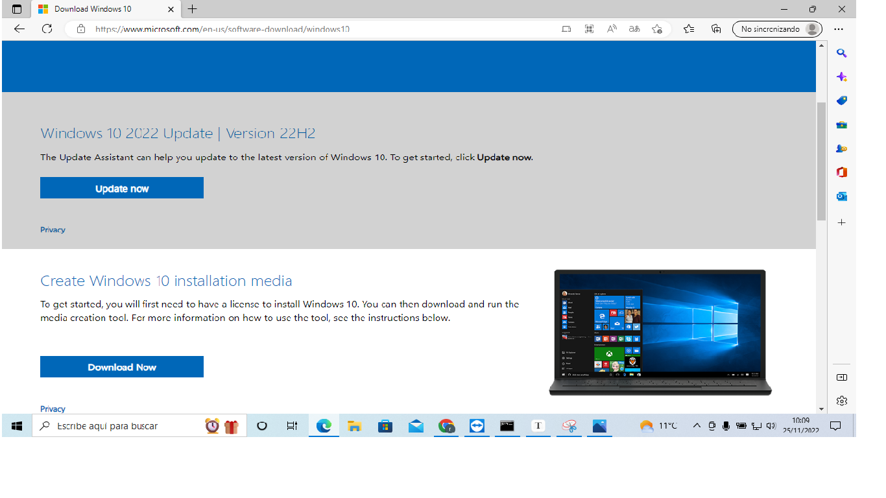
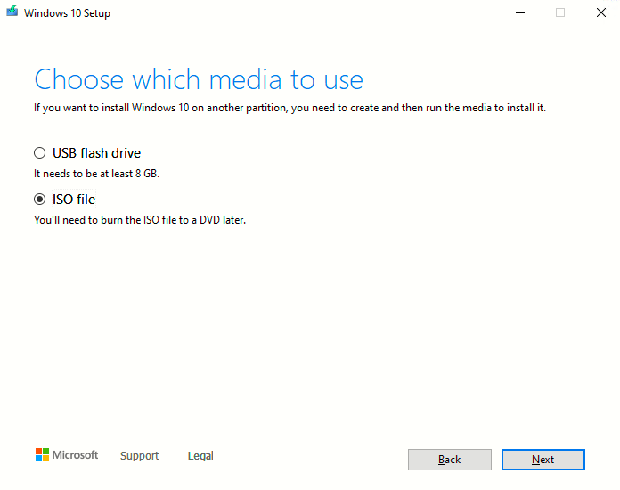
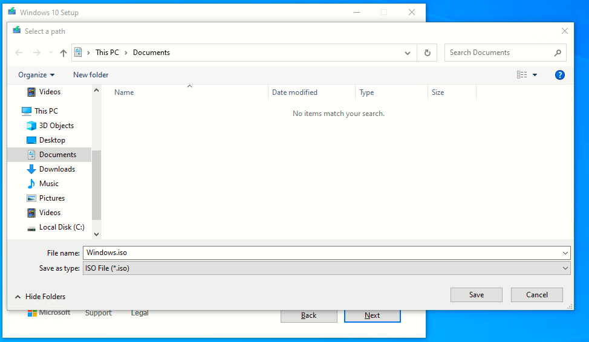
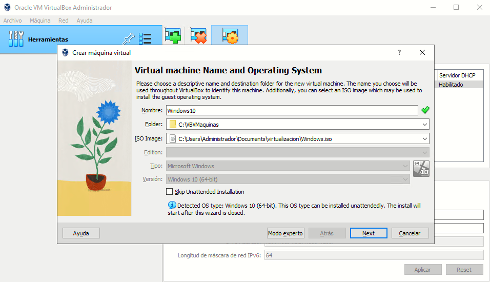
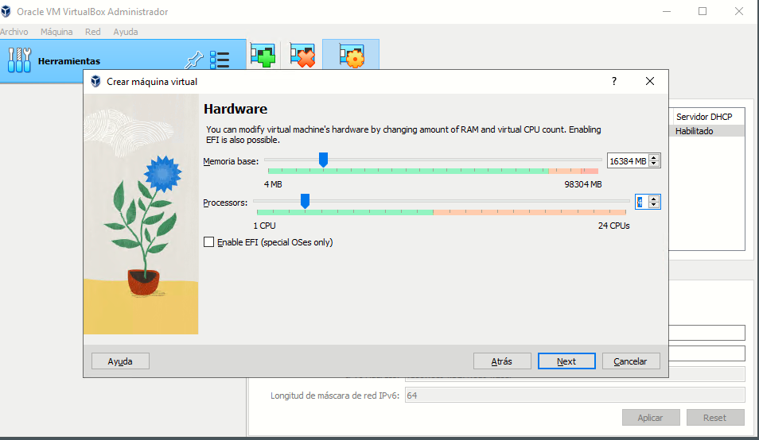
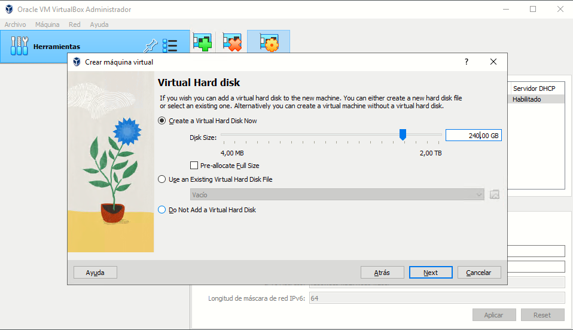
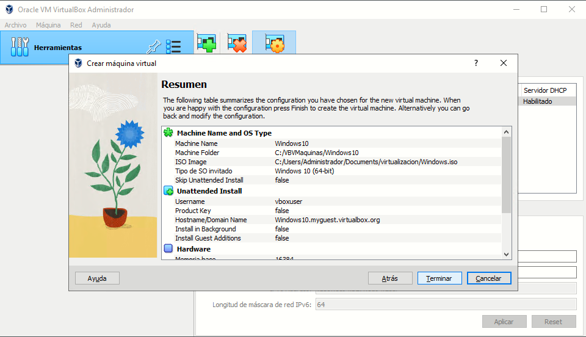

# Instalando S.O en VM

instalación de windows 10, windows server 2019 y centOS en virtual box.

25 de Noviembre de 2022

## Paso 1º

El primer paso consistirá en descargar las ISO de los distintos SO que vamos a instalar.

### WINDOWS 10

Descargamos archivo ISO de este enlace pinchar [aqui](https://www.microsoft.com/en-us/software-download/windows10)

Nos aparece esta web.

Pulsamos el boton "download now".

Una vez descargado ejecutamos el archivo y nos aparecerá la siguiente ventana.

Aceptamos los términos de acuerdo y avanzamos a la siguiente ventana.

Seleccionamos la opción de "Create installation media (USB flash drive, DVD, or ISO file) for another PC"

Continuamos con el proceso.

Elegimos la configuración del windows idioma, edición (home, pro, interprises) y la arquitectura (64 o 32 bits). Continuamos.

 

Seleccionamos la opción de ISO file, para instalarlo en la máquina virtual.

Guardamos el archivo donde prefiramos.

Empezerá el proceso de descarga (tardará unos minutos).

Una vez descargado nos aparecerá la imagen de arriba, pulsamos finish y acabamos el proceso.

### CENT OS

Para descargar **cent OS** es mas fácil que windows 10, puesto que solo necesitaremos descargar la imagen ISO del siguiente  [enlace](https://www.centos.org/download/)

Seleccionamos la opción señalada, nos llevará a seleccionar un mirror.

Seleccionamos el mirror mas cercano en este caso el primero. Descargamos el archivo .ISO y guardamos.

### WINDOWS SERVER 2019

Vamos al siguiente [enlace](https://www.microsoft.com/en-us/evalcenter/download-windows-server-2019)

Seleccionamos la opción que queramos, descargamos el archivo .ISO y guardamos.

## Paso 2º

El siguiente paso del proceso será descargar el software Virtual Box y configurarlo para la posterior instalación de los diferentes sistemas operativos.

Descargaremos el software en el siguiente [enlace](https://www.oracle.com/virtualization/technologies/vm/downloads/virtualbox-downloads.html).

Nos aparecerá lo siguiente en el navegador.

Seleccionamos el enlace marcado en la foto y procederemos a descargar e instalar el sofware.

Una vez instalado procederemos a configurarlo.

En el menú principal le daremos a **Máquina** y configuración, procederemos a crear una carpeta para guardar las diferentes máquinas, despues seleccionaremos la imagen **ISO** que vayamos a instalar, en este caso Windows 10.

Procederemos a asignar la memoria **RAM** y los **núcleos** que queramos asignar como en la imagen de acontinución, en nuestro caso aplicaremos 16GB de **RAM** y 4 **núcleos**. Estas medidas se aplicaran en los 3 Sistemas Operativos.

Más tarde asignaremos el espacio del disco duro virtual, en este caso 240GB, esta cantidad nos servirá de referencia para los 3 sistemas operativos.

Con esto finalizaremos el proceso de creación de las máquinas virtuales, este proceso se tendría que repetir con las imágenes ISO de **CentOS** y **Windows server 2019**. Una vez acabado nos saldrá el sguiente cuadro resumiendo los pasos dados anteriormente.

## 3er Paso ##

Instalaremos los sistemas operativos en las diferentes máquinas que hayamos creado.

### Windows 10 ###

Iniciaremos la máquina virtual de windows 10, seleccionando dicha máquina y pulsando el boton **iniciar**

Una vez iniciado, nos saldrá la imagen superior, despues de cargar continuaremos con el proceso.

Aparecerá la siguiente imagen, esperaremos a que acabe de cargar y continuaremos el proceso.

Una vez termina de cargar se reiniciará la máquina y continuamos con el proceso.

Una vez termina de reiniciar saldrá la siguiente pantalla, esta tardará unos minutos, despues de esto empezerá el proceso de instalación de características.

El proceso durará unos minutos, una vez acabado saldrá la siguiente pantalll.

Ya queda poco para acabar, iniciaremos por primera vez el sistema, el primer inicio será un poco largo ya que el sistema terminará de instalar los últimos elementos.

Una vez termine de instalar los últimos procesos ya tendremos instalado el sistema, cada vez que queramos entrar no tendremos nada mas que seleccionar la máquina y pulsar el botón iniciar.

### Cent OS ###

Seleccionaremos la máquina donde hayamos seleccionado la ISO del CentOS, pulsaremos el boton iniciar, nos saldrá la siguiente imagen.

Una vez carguen los primeros datos nos saldrá una ventana para elegir idioma y teclado.

Una vez definido el idioma y el teclado es hora de crear el usuario, establecer la contraseña de root para administrador.

Crearemos el usuario y definiremos la contraseña que en nuestro caso seran

usuario:**usuario**

pass: **usuario**

Ahora estableceremos la pass de root, en nuestro caso será la misma que en el usuario.

Una vez definidos los parámetros, ya estará instalado el sistema, lo primero que nos pedirá es el usuario y la pass.

Con esto finalizaremos el proceso de instalació, como con el sistema anterior, para volver a entrar solo bastaria con seleccionar la máquina que contenga la ISO del sistema CentOS y pulsar el boton iniciar.

### Windows Server 2019 ###

