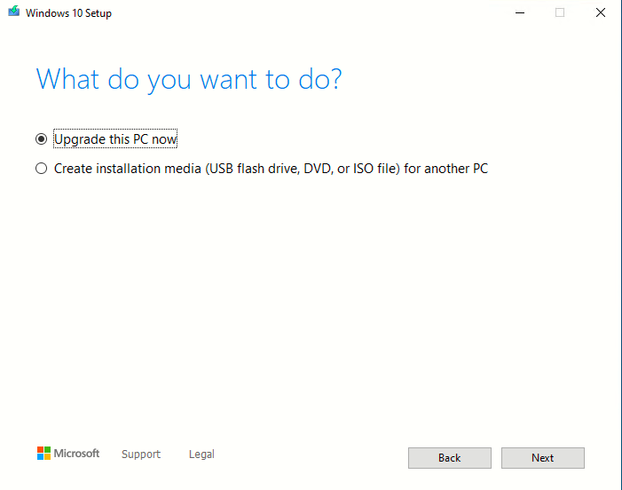

# Instalando S.O en VM

instalación de windows 10, windows server 2019 y centOS en virtual box.

25 de Noviembre de 2022

## Paso 1º

### WINDOWS 10

Descargamos archivo ISO de este enlace pinchar [aqui](https://www.microsoft.com/en-us/software-download/windows10)

Nos aparece esta web.

Pulsamos el boton "download now".

Una vez descargado ejecutamos el archivo y nos aparecerá la siguiente ventana.

Aceptamos los términos de acuerdo y avanzamos a la siguiente ventana.

Seleccionamos la opción de "Create installation media (USB flash drive, DVD, or ISO file) for another PC"

Continuamos con el proceso.

Elegimos la configuración del windows idioma, edición (home, pro, interprises) y la arquitectura (64 o 32 bits). Continuamos.

 

Seleccionamos la opción de ISO file, para instalarlo en la máquina virtual.

Guardamos el archivo donde prefiramos.

Empezerá el proceso de descarga (tardará unos minutos).

Una vez descargado nos aparecerá la imagen de arriba, pulsamos finish y acabamos el proceso.

### CENT OS

Para descargar **cent OS** es mas fácil que windows 10, puesto que solo necesitaremos descargar la imagen ISO del siguiente  [enlace](https://www.centos.org/download/)

Seleccionamos la opción señalada, nos llevará a seleccionar un mirror.

Seleccionamos el mirror mas cercano en este caso el primero. Descargamos el archivo .ISO y guardamos.

### WINDOWS SERVER 2019

Vamos al siguiente [enlace](https://www.microsoft.com/en-us/evalcenter/download-windows-server-2019)

Seleccionamos la opción que queramos, descargamos el archivo .ISO y guardamos.

